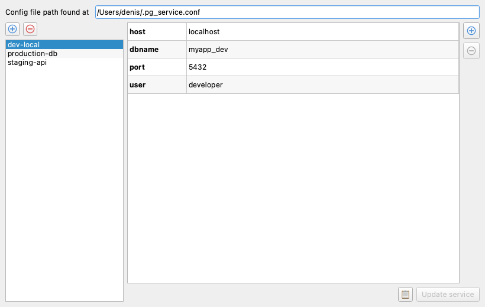
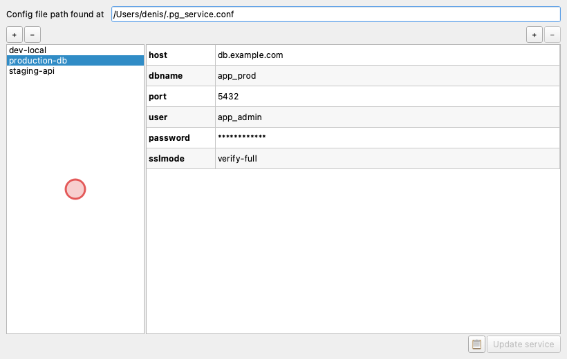
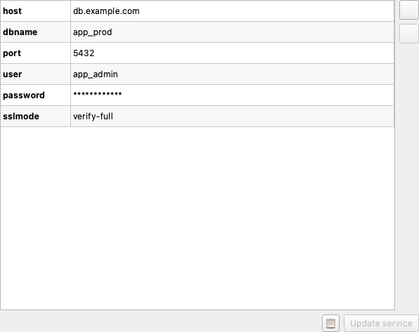

# GUI

**pgserviceparser** ships with a graphical interface for managing PostgreSQL connection services.

## Installation

Install the GUI extra:

```bash
pip install pgserviceparser[gui]
```

This pulls in [PyQt6](https://pypi.org/project/PyQt6/) as an additional dependency.

!!! note "QGIS compatibility"
    When running inside **QGIS**, the bundled `qgis.PyQt` bindings are used
    automatically — no separate PyQt6 install is needed.

## Launching the application

Run the console script:

```bash
pgserviceparser-gui
```

Or invoke the module directly:

```bash
python -m pgserviceparser.gui
```

## Overview

The main window displays two panels:

- **Service list** (left) — all services found in the active `pg_service.conf` file.
- **Settings editor** (right) — key/value pairs for the selected service.



## Managing services

Click the **+** button to create a new service, or the **−** button to remove
the selected one(s). Right-click a service for *Rename* and *Duplicate* options.



## Editing settings

Select a service to load its settings into the editor table. Double-click a
value cell to edit it. Use the **+** / **−** buttons next to the table to add
or remove individual settings. Press **Update service** to persist changes back
to disk.



Passwords are masked by default and revealed only during editing.

## Configuration file

The status bar at the top shows the active configuration file path. If no file
is found, you can create one at the default location with a single click.
